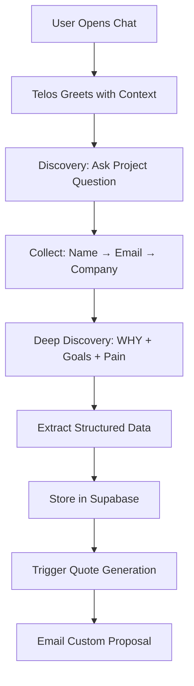

# 🤖 Telos AI — Are You Human?

> **Stay Human. Stay Ahead.**

An AI-powered lead qualification and project briefing system that transforms business conversations into intelligent proposals through **conversational design** and **conscious AI integration**.

[](https://astro.build)
[](https://openai.com)
[](https://vercel.com)

---

## 📖 Table of Contents

- [Vision & Philosophy](#-vision--philosophy)
- [How Telos AI Works](#-how-telos-ai-works)
- [Architecture & Planning](#-architecture--planning)
- [Prompt Engineering System](#-prompt-engineering-system)
- [Tech Stack](#-tech-stack)
- [Features](#-features)
- [Setup & Installation](#-setup--installation)
- [Deployment](#-deployment)
- [Project Structure](#-project-structure)
- [Contributing](#-contributing)

---

## 🌟 Vision & Philosophy

### The Problem We're Solving

Most AI chatbots are **transactional**, not **transformational**. They fill forms instead of building relationships. They extract data instead of understanding context.

**Telos AI** is different.

### Our Approach: Conversational Design

Telos isn't just a chatbot — it's a **conscious design assistant** that:
- 🧠 **Listens deeply** before proposing solutions
- 💬 **Speaks human-first**, not robot-first
- 🎯 **Qualifies leads** through discovery, not interrogation
- 📊 **Structures insights** for intelligent follow-up
- ⚡ **Moves fast** while maintaining empathy

### Philosophy: Humanity. Amplified.

> "AI should amplify, not replace, humanity. The more intelligent AI becomes, the more valuable human creativity becomes."

**The Human Advantage Framework™** guides our AI integration:
1. **Discover** — Map human value before adding automation
2. **Design** — Architect systems that preserve consciousness
3. **Deploy** — Launch with human checkpoints
4. **Defend** — Continuously audit the human/AI balance

---

## 🎯 How Telos AI Works

### The Telos Workflow



### The 5-Message Sequence (Critical Rule #1)

Telos is designed to **collect contact information within the first 5 messages**:

```
Message 1: Ask ONE project question with examples
Message 2: User answers
Message 3: "What's your name?" ← GET NAME
Message 4: "Where should I send your quote?" ← GET EMAIL  
Message 5: "What's your company called?" ← GET COMPANY
```

**Why?** Early contact collection ensures we never lose a qualified lead, even if the conversation drops off.

### Conversational Phases

#### Phase 1: Opening (Message 1)
- Ask **one clear question** with examples
- Set the tone: curious, human, helpful
- Example: *"What's the main challenge you're trying to solve? (e.g., automating customer service, building an AI assistant, connecting multiple systems)"*

#### Phase 2: Contact Collection (Messages 3-5)
- Use **cognitive copy** to make data collection feel natural
- "Who should I make the proposal out to?" (not "What's your name?")
- "Where should I send your quote?" (not "What's your email?")
- "What's the name of your company or brand?" (conversational)

#### Phase 3: Deep Discovery (Messages 6+)
The **real value** happens here. Telos asks layered questions to understand:

1. **Goals & WHY** — Business drivers and urgency
2. **Current Pain** — Frustrations and inefficiencies  
3. **Success Metrics** — What winning looks like
4. **Context & Constraints** — Tools, budgets, dealbreakers
5. **Vision & Scale** — Long-term opportunities

> "The quality of your quote is directly proportional to the quality of your questions."

#### Phase 4: Structured Output
- Extract lead data using GPT-4o-mini with JSON mode
- Store in Supabase for CRM and analytics
- Trigger automated quote generation
- Email custom proposal with pricing and roadmap

---

## 🏗️ Architecture & Planning

### System Design

Telos AI is built on a **modular, prompt-driven architecture** that separates concerns:

```
┌─────────────────────────────────────────────┐
│           Frontend (Astro + Vue)            │
│  - Landing page (static SSG)                │
│  - Interactive chat (Vue hydration)         │
│  - Smooth animations (GSAP + Lenis)         │
└─────────────────┬───────────────────────────┘
                  │
┌─────────────────┴───────────────────────────┐
│        API Layer (Astro API Routes)         │
│  - /api/chat (OpenAI integration)           │
│  - Token optimization                       │
│  - Lead extraction                          │
│  - Quote triggers                           │
└─────────────────┬───────────────────────────┘
                  │
┌─────────────────┴───────────────────────────┐
│         AI Layer (OpenAI GPT-4o-mini)       │
│  - Dynamic prompt composition               │
│  - Conversational memory                    │
│  - Structured data extraction               │
│  - Stage-based system prompts               │
└─────────────────┬───────────────────────────┘
                  │
┌─────────────────┴───────────────────────────┐
│       Data Layer (Supabase Postgres)        │
│  - Lead storage & qualification             │
│  - Conversation history (JSONB)             │
│  - RLS policies for security                │
│  - Real-time analytics views                │
└─────────────────────────────────────────────┘
```

### Planning Process

#### 1. Discovery Phase
We started with core questions:
- How do we make AI feel **conscious**, not mechanical?
- How do we qualify leads **through conversation**, not forms?
- How do we **preserve context** without hitting token limits?
- How do we make responses feel **human-first**?

#### 2. Prompt Architecture Design
Created a **modular prompt system** with:
- **Stage-based prompts** (briefing, quote, follow-up)
- **Reusable context modules** (knowledge, tone, examples)
- **Dynamic composition** (load only what's needed)
- **Token optimization** (compress history, summarize when needed)

#### 3. Conversational Flow Mapping
Designed flows for:
- Lead qualification (5-message sequence)
- Deep discovery (layered questioning)
- Edge cases (clarifications, objections, time-wasters)
- Exit strategies (polite endings, redirects)

#### 4. Technical Implementation
Built with:
- **Astro** for fast, SEO-friendly pages
- **Vue 3** for reactive chat interface
- **OpenAI GPT-4o-mini** for cost-effective intelligence
- **Supabase** for real-time data and auth
- **GSAP + Lenis** for premium animations

---

## 🧠 Prompt Engineering System

### Modular Prompt Architecture

Telos uses a **file-based prompt system** that composes prompts dynamically:

```
src/data/
├── prompts/              # Core system prompts
│   ├── objective.md      # Telos identity & mission
│   ├── briefing.md       # Lead qualification flow
│   ├── lead-collection.md # Contact data capture rules
│   ├── quote-builder.md  # Proposal generation
│   ├── insights.md       # Deep discovery questions
│   ├── exits.md          # Graceful conversation endings
│   └── ...
├── context/              # Reusable context modules
│   ├── knowledge.md      # Brand & service info
│   ├── tone.md           # Voice & personality
│   ├── examples.md       # Sample conversations
│   ├── pricing.md        # Budget frameworks
│   └── ...
└── examples/
    ├── conversation.json # Training examples
    ├── lead-example.json # Data structure samples
    └── quote-example.json # Output formats
```

### Prompt Composition Flow

1. **Select Stage** — Load appropriate prompt file (e.g., `briefing.md`)
2. **Add Context** — Inject relevant modules (knowledge, tone, examples)
3. **Optimize Tokens** — Compress or summarize based on conversation length
4. **Compose Message** — Build final system prompt dynamically
5. **Send to OpenAI** — Get contextually aware response

### Key Prompt Engineering Techniques

#### 1. Critical Rules System
Using **⚠️ CRITICAL RULE** headers to prioritize behaviors:
```markdown
## ⚠️ CRITICAL RULE #1: COLLECT Name, Email, Company in FIRST 5 MESSAGES
```

#### 2. Cognitive Copy Patterns
Reframing data collection as conversation:
- ❌ "What's your name?" → ✅ "Who should I make the proposal out to?"
- ❌ "What's your email?" → ✅ "Where should I send your quote?"
- ❌ "Company name?" → ✅ "What's the name of your business or brand?"

#### 3. Example-Driven Instructions
Always show examples in instructions:
```markdown
**✅ GOOD (Include Examples):**
"What's the main challenge you're trying to solve? 
*(e.g., automating customer service, building an AI assistant)*"

**❌ BAD (Too Vague):**
"What can I assist you with today?"
```

#### 4. Usage Constraints
Preventing overuse of signature phrases:
```markdown
## ⚠️ CRITICAL RULE #2: "Human" Usage

✅ ONLY use "Human" in these 3 situations:
1. Opening greeting (first message only)
2. Emotional reflection (when validating)
3. Closing statement (wrapping up)

❌ NEVER use "Human" in:
- Regular questions (use "you" instead)
- Mid-conversation clarifications
```

#### 5. Role-Specific Boundaries
Clear separation of responsibilities:
```markdown
## ⚠️ CRITICAL RULE #3: You Are a Lead Qualifier, Not a Quote Generator

**NEVER Do This (❌)**
- ❌ "Your project will cost $5,000"
- ❌ Generate pricing or timelines in chat

**ALWAYS Do This (✅)**
- ✅ Collect project context through conversation
- ✅ Trigger the quote system (it will email them)
```

### Token Optimization Strategy

**Challenge**: Keep full context without hitting 128K token limits.

**Solution**: Multi-layer optimization
```javascript
// 1. Compress old messages
function optimizeMessagePayload(systemPrompt, messages, summary) {
  const tokens = countTokens(systemPrompt, messages);
  
  if (tokens > TOKEN_THRESHOLD) {
    // Summarize middle messages, keep first/last for context
    return [
      systemPrompt,
      ...messages.slice(0, 3),        // Keep opening
      { role: 'system', content: summary }, // Summary
      ...messages.slice(-3)           // Keep recent
    ];
  }
  
  return [systemPrompt, ...messages];
}

// 2. Generate summaries when needed
async function generateSummary(messages) {
  return await openai.chat.completions.create({
    model: 'gpt-4o-mini',
    messages: [{
      role: 'system',
      content: 'Summarize this conversation in 100 words'
    }, ...messages]
  });
}
```

---

## 🛠️ Tech Stack

### Frontend
| Technology | Purpose | Why We Chose It |
|------------|---------|-----------------|
| **Astro 5** | Static site generator | Fast, SEO-friendly, partial hydration |
| **Vue 3** | Reactive components | Smooth chat interface, composition API |
| **GSAP** | Animations | Industry standard, performant, flexible |
| **Lenis** | Smooth scroll | Native feel, mobile-optimized |
| **TypeScript** | Type safety | Better DX, fewer runtime errors |

### Backend & AI
| Technology | Purpose | Why We Chose It |
|------------|---------|-----------------|
| **OpenAI GPT-4o-mini** | Conversational AI | Fast, cost-effective, high quality |
| **Supabase** | Database + Auth | Postgres + real-time + RLS |
| **Astro API Routes** | Backend logic | Serverless, fast, integrated |

### Infrastructure
| Technology | Purpose | Why We Chose It |
|------------|---------|-----------------|
| **Vercel** | Hosting | Edge network, zero-config, automatic CI/CD |
| **GitHub** | Version control | Industry standard, great CI integration |

### Development
| Tool | Purpose |
|------|---------|
| **npm** | Package management |
| **Git** | Version control |
| **ESLint** | Code quality |

---

## ✨ Features

### 🎨 Frontend Experience
- ✅ **Beautiful landing page** with smooth animations
- ✅ **Interactive entrance UI** ("Are You Human?" slider)
- ✅ **Smooth scroll** (Lenis integration, disabled on mobile)
- ✅ **Modal drawer** with custom easing curves
- ✅ **Backdrop blur effects** for premium feel
- ✅ **Responsive design** (desktop, tablet, mobile)
- ✅ **Premium typography** (PP Neue Machina, PP Supply Mono)

### 🤖 AI Capabilities
- ✅ **Conversational lead qualification**
- ✅ **Smart contact data collection** (5-message sequence)
- ✅ **Deep discovery questioning** (WHY, goals, pain, vision)
- ✅ **Structured data extraction** (JSON mode)
- ✅ **Token optimization** (compression + summarization)
- ✅ **Stage-based prompts** (briefing, quote, follow-up)
- ✅ **Conversation memory** (context preservation)

### 📊 Data & Analytics
- ✅ **Supabase Postgres** for structured storage
- ✅ **Lead scoring system** (1-10 interest level)
- ✅ **Conversation history** (JSONB storage)
- ✅ **Real-time analytics views**
- ✅ **Row-level security** (RLS policies)
- ✅ **Automatic timestamps** (created_at, updated_at)

### 🔧 Developer Experience
- ✅ **TypeScript throughout**
- ✅ **Modular architecture** (components, composables, utils)
- ✅ **Environment-based config**
- ✅ **Hot module replacement** (HMR)
- ✅ **Built-in API routes**
- ✅ **One-command deployment**

---

## 🚀 Setup & Installation

### Prerequisites

- **Node.js** 18+ ([Download](https://nodejs.org))
- **npm** or **yarn**
- **Supabase account** ([Sign up](https://supabase.com))
- **OpenAI API key** ([Get key](https://platform.openai.com/api-keys))
- **Vercel account** (optional, for deployment)

### 1. Clone the Repository

```bash
git clone https://github.com/muriloscigliano/areyouhuman.git
cd areyouhuman
```

### 2. Install Dependencies

```bash
npm install
```

### 3. Configure Environment Variables

Copy the environment template:

```bash
cp env.template .env
```

Update `.env` with your credentials:

```env
# Supabase
PUBLIC_SUPABASE_URL=https://your-project.supabase.co
PUBLIC_SUPABASE_ANON_KEY=your-anon-key-here

# OpenAI
OPENAI_API_KEY=sk-your-api-key-here

# Optional: n8n Webhook (for lead routing)
N8N_WEBHOOK_URL=https://your-n8n-instance.com/webhook/lead
```

### 4. Set Up Supabase Database

1. Go to [Supabase Dashboard](https://app.supabase.com)
2. Create a new project
3. Go to **SQL Editor**
4. Copy and run `supabase-schema.sql`

This creates:
- `leads` table with all necessary columns
- Indexes for performance
- Row-level security (RLS) policies
- Analytics views
- Automatic triggers

### 5. Run Development Server

```bash
npm run dev
```

Open [http://localhost:4321](http://localhost:4321) 🎉

---

## 📦 Deployment

### Deploy to Vercel (Recommended)

#### Option 1: GitHub Integration (Easiest)

1. Push code to GitHub
2. Go to [Vercel Dashboard](https://vercel.com)
3. Click **"Add New Project"**
4. Import your GitHub repository
5. Add environment variables:
   - `PUBLIC_SUPABASE_URL`
   - `PUBLIC_SUPABASE_ANON_KEY`
   - `OPENAI_API_KEY`
6. Click **"Deploy"**

Vercel auto-detects Astro and configures everything!

#### Option 2: Vercel CLI

```bash
# Install Vercel CLI
npm i -g vercel

# Deploy
vercel

# Add environment variables
vercel env add PUBLIC_SUPABASE_URL
vercel env add PUBLIC_SUPABASE_ANON_KEY
vercel env add OPENAI_API_KEY

# Deploy to production
vercel --prod
```

### Deploy to Other Platforms

Telos AI can deploy anywhere that supports Node.js:

- **Netlify**: Use `npm run build` and deploy `dist/`
- **Railway**: Connect GitHub repo and add env vars
- **AWS Amplify**: Use Astro SSR adapter
- **Cloudflare Pages**: Use Astro Cloudflare adapter

---

## 📁 Project Structure

```
areyouhuman/
├── public/                      # Static assets
│   ├── fonts/                   # Custom typography
│   │   ├── PPNeueMachina-*.otf  # Brand font
│   │   └── PPSupplyMono-*.otf   # Monospace font
│   └── favicon.svg              # Site icon
│
├── src/
│   ├── components/              # Vue & Astro components
│   │   ├── AiChat.vue           # Main chat container
│   │   ├── AiMessage.vue        # Message bubbles
│   │   ├── AiInput.vue          # Chat input field
│   │   ├── ContactModal.vue     # Drawer modal with custom ease
│   │   ├── AreYouHuman.vue      # Interactive entrance slider
│   │   ├── HeroSection.vue      # Landing hero with GSAP
│   │   ├── StatementSection.vue # Scroll-triggered content
│   │   ├── FooterSection.astro  # Static footer
│   │   └── ...                  # Other sections
│   │
│   ├── composables/             # Reusable Vue composition functions
│   │   ├── useChatApi.js        # Chat API integration
│   │   ├── useContactModal.ts   # Modal state management
│   │   ├── useGsap.js           # GSAP + ScrollTrigger setup
│   │   ├── useLenis.js          # Smooth scroll integration
│   │   └── useSupabase.js       # Supabase client
│   │
│   ├── data/                    # Prompt engineering & context
│   │   ├── prompts/             # Stage-based AI prompts
│   │   │   ├── objective.md     # Core identity & mission
│   │   │   ├── briefing.md      # Lead qualification flow
│   │   │   ├── lead-collection.md # Contact capture rules
│   │   │   ├── quote-builder.md # Proposal generation
│   │   │   ├── insights.md      # Deep discovery questions
│   │   │   ├── exits.md         # Conversation endings
│   │   │   └── ...
│   │   ├── context/             # Reusable context modules
│   │   │   ├── knowledge.md     # Brand & services
│   │   │   ├── tone.md          # Voice & personality
│   │   │   ├── examples.md      # Sample conversations
│   │   │   ├── pricing.md       # Budget frameworks
│   │   │   ├── greetings.json   # Dynamic greetings
│   │   │   └── ...
│   │   └── examples/            # Training data
│   │       ├── conversation.json
│   │       ├── lead-example.json
│   │       └── quote-example.json
│   │
│   ├── layouts/
│   │   └── LandingLayout.astro  # Base HTML layout
│   │
│   ├── lib/                     # Core utilities
│   │   ├── openai.ts            # OpenAI client & prompt composition
│   │   ├── supabase.ts          # Supabase client config
│   │   ├── pdfGenerator.ts      # Quote PDF generation
│   │   ├── sendEmail.ts         # Email service
│   │   └── n8nTrigger.ts        # n8n webhook integration
│   │
│   ├── pages/
│   │   ├── index.astro          # Landing page
│   │   └── api/                 # Backend API routes
│   │       ├── chat.ts          # Main chat endpoint
│   │       ├── leads.ts         # Lead data API
│   │       ├── quote.ts         # Quote generation
│   │       └── ...
│   │
│   ├── styles/
│   │   ├── global.css           # Global styles & utilities
│   │   └── globals.css          # Additional globals
│   │
│   └── utils/                   # Helper functions
│       ├── parsePrompt.js       # Dynamic prompt builder
│       ├── tokenManager.js      # Token optimization
│       ├── conversationState.js # State management
│       └── ...
│
├── supabase-schema.sql          # Database schema
├── astro.config.mjs             # Astro configuration
├── vercel.json                  # Vercel deployment config
├── tsconfig.json                # TypeScript config
├── package.json                 # Dependencies
├── env.template                 # Environment variables template
└── README.md                    # This file
```

---

## 🎓 Key Learnings & Best Practices

### Prompt Engineering Insights

1. **Critical Rules Work** — Using `⚠️ CRITICAL RULE` headers significantly improved model compliance
2. **Examples > Explanations** — Showing examples in prompts works better than describing behaviors
3. **Cognitive Copy Matters** — Reframing questions makes data collection feel natural
4. **Token Optimization is Essential** — Without compression, costs spiral quickly
5. **Modular Prompts Scale** — File-based prompts are easier to maintain than monolithic strings

### Technical Insights

1. **Astro + Vue = Perfect Combo** — Static where possible, interactive where needed
2. **GSAP + Lenis = Premium Feel** — Smooth animations elevate perceived value
3. **Custom Easing Functions** — Pure JS cubic-bezier implementation works better than premium plugins
4. **Supabase RLS** — Row-level security prevents security vulnerabilities
5. **Vercel Edge** — Global edge network makes apps feel instant

### Conversational Design Insights

1. **Early Contact Collection** — Get name/email in first 5 messages or lose leads
2. **One Question at a Time** — Multi-question prompts overwhelm users
3. **Deep Discovery = Better Quotes** — Quality of questions determines quality of output
4. **Human Language** — "You" feels warmer than "Human" in most contexts
5. **Graceful Exits** — Design for drop-offs and time-wasters

---

## 🤝 Contributing

Contributions are welcome! Please follow these guidelines:

### Issues
- Check existing issues before creating new ones
- Use descriptive titles and detailed descriptions
- Include steps to reproduce bugs

### Pull Requests
1. Fork the repository
2. Create a feature branch: `git checkout -b feature/amazing-feature`
3. Commit your changes: `git commit -m 'Add amazing feature'`
4. Push to the branch: `git push origin feature/amazing-feature`
5. Open a Pull Request

### Code Style
- Use TypeScript for type safety
- Follow existing naming conventions
- Add comments for complex logic
- Test locally before submitting

---

## 📄 License

MIT License - see LICENSE file for details

---

## 👨‍💻 Author

**Murilo Scigliano**  
AI Strategist & Founder, Are You Human?

- 🌐 Website: [areyouhuman.com](https://areyouhuman.com)
- 💼 GitHub: [@muriloscigliano](https://github.com/muriloscigliano)
- 📧 Email: contact@areyouhuman.com

---

## 🙏 Acknowledgments

- **OpenAI** for GPT-4o-mini and powerful APIs
- **Supabase** for the best Postgres experience
- **Vercel** for effortless deployment
- **Astro** for redefining static site generation
- **GSAP** for animation excellence

---

## 📚 Additional Resources

### Documentation
- [Complete Setup Guide](SETUP_GUIDE.md)
- [Prompt Engineering Deep Dive](DEEP_DISCOVERY_FRAMEWORK.md)
- [AI Integration Guide](AI_INTEGRATION.md)
- [Database Testing Guide](DATABASE_TESTING_GUIDE.md)
- [Token Optimization](TOKEN_OPTIMIZATION_COMPLETE.md)

### Useful Links
- [Astro Documentation](https://docs.astro.build)
- [Vue 3 Documentation](https://vuejs.org)
- [OpenAI API Docs](https://platform.openai.com/docs)
- [Supabase Documentation](https://supabase.com/docs)
- [GSAP Documentation](https://greensock.com/docs/)

---

<div align="center">

**Built with ❤️ and ⚡ AI**

*Stay Human. Stay Ahead.*

</div>
