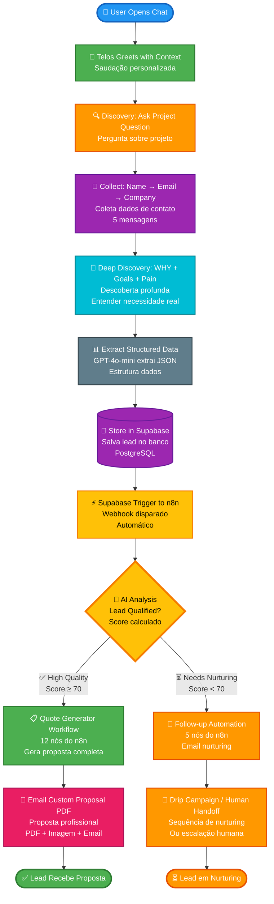

# Sistema Inteligente de Qualificação e Automação de Leads com IA

## Objetivo

Este projeto tem como objetivo automatizar a qualificação de leads e a geração de propostas comerciais utilizando **Inteligência Artificial Generativa** e **automação de workflows**.

A solução busca transformar conversas de negócios em propostas profissionais automatizadas, reduzindo o tempo de resposta e aumentando a taxa de conversão através de:

- **Qualificação inteligente de leads** através de conversação natural
- **Geração automática de propostas** com PDF profissional, imagens personalizadas e emails
- **Roteamento inteligente** baseado em qualidade do lead (proposta completa vs. nurturing)
- **Análise de qualidade** usando IA para determinar o melhor caminho de follow-up

---

## Ferramentas Utilizadas

### Plataforma de Automação
**n8n** - Plataforma de automação de workflows open-source
- Hospedado em: Railway.app
- URL: `https://areyouhuman.up.railway.app`

### Motor de IA
**OpenAI GPT-4o-mini** e **GPT-4o** (via integração nativa no n8n)
- Análise de qualidade de leads
- Geração de propostas profissionais
- Criação de emails personalizados
- Geração de prompts para imagens

### Serviços Integrados
- **Supabase** - Banco de dados PostgreSQL para armazenamento de leads
- **Banana.dev (Gemini Nano)** - Geração de imagens de capa para propostas
- **Nutrient.io** - Conversão de HTML para PDF
- **Email Service** - Envio de emails com propostas anexadas

---

## Fluxo Completo do Telos (End-to-End)

### Fluxograma: Do Chat à Proposta



---

## Arquitetura do Sistema

### Fluxograma Arquitetural em Camadas

```mermaid
flowchart TD
    subgraph Frontend["🌐 Frontend (Astro + Vue)"]
        F1[Landing page<br/>static SSG]
        F2[Interactive chat<br/>Vue hydration]
        F3[Smooth animations<br/>GSAP + Lenis]
    end
    
    Frontend -.->|HTTP Request| API
    
    subgraph API["⚙️ API Layer (Astro API Routes)"]
        A1[/api/chat<br/>OpenAI integration]
        A2[Token optimization]
        A3[Lead extraction]
        A4[Supabase write operations]
    end
    
    API -.->|API Calls| AI
    
    subgraph AI["🤖 AI Layer (OpenAI GPT-4o-mini)"]
        AI1[Dynamic prompt composition]
        AI2[Conversational memory]
        AI3[Structured data extraction]
        AI4[Stage-based system prompts]
    end
    
    AI -.->|Store Data| Data
    
    subgraph Data["💾 Data Layer (Supabase Postgres)"]
        D1[Lead storage & qualification]
        D2[Conversation history<br/>JSONB]
        D3[RLS policies<br/>for security]
        D4[Database triggers<br/>webhook on insert]
    end
    
    Data -.->|Webhook Trigger| Automation
    
    subgraph Automation["🔄 Automation Layer (n8n Workflows)"]
        subgraph Router["🔀 Smart Lead Router (AI-Powered)"]
            R1[Analyze lead quality & intent]
            R2[Score: interest_level<br/>budget, etc]
            R3[Route to appropriate workflow]
        end
        
        Router -.->|TRUE Path| QuoteGen
        Router -.->|FALSE Path| FollowUp
        
        subgraph QuoteGen["📋 Quote Gen"]
            Q1[Build PDF]
            Q2[Pricing]
            Q3[Send email]
        end
        
        subgraph FollowUp["📧 Follow-up Auto"]
            FU1[Drip campaigns]
            FU2[Nurture emails]
            FU3[Human handoff]
        end
    end
    
    style Frontend fill:#2196F3,stroke:#1565C0,stroke-width:2px,color:#fff
    style API fill:#9C27B0,stroke:#6A1B9A,stroke-width:2px,color:#fff
    style AI fill:#FF9800,stroke:#E65100,stroke-width:2px,color:#fff
    style Data fill:#4CAF50,stroke:#2E7D32,stroke-width:2px,color:#fff
    style Automation fill:#00BCD4,stroke:#00838F,stroke-width:2px,color:#fff
    style Router fill:#FFC107,stroke:#F57C00,stroke-width:2px,color:#000
    style QuoteGen fill:#4CAF50,stroke:#2E7D32,stroke-width:2px,color:#fff
    style FollowUp fill:#FF9800,stroke:#E65100,stroke-width:2px,color:#fff
```

---

## Fluxo do Workflow n8n

### Fluxograma Principal - Workflow Completo

```mermaid
flowchart TD
    Start([🌐 Webhook<br/>Recebe Lead]) --> Webhook[📥 Webhook Node<br/>HTTP POST]
    Webhook --> Supabase[(💾 Supabase<br/>Armazena Lead)]
    Supabase --> AIAnalysis[🤖 AI Analysis<br/>Analisa Qualidade<br/>OpenAI GPT-4o]
    AIAnalysis --> Router{🔀 IF Router<br/>Score ≥ 70?}
    
    Router -->|✅ TRUE<br/>Lead Qualificado| GoodPath[📋 Good Lead Path]
    Router -->|⏳ FALSE<br/>Score < 70| BadPath[📧 Bad Lead Path]
    
    GoodPath --> Enhance[✨ AI Enhance Quote<br/>OpenAI GPT-4o]
    Enhance --> Parse1[📝 Parse Enhanced Quote<br/>Code Node]
    Parse1 --> GenerateImg[🎨 AI Generate Cover Image<br/>Gemini Nano via Banana.dev]
    GenerateImg --> Parse2[📝 Parse Cover Image URL<br/>Code Node]
    Parse2 --> GenerateHTML[📄 Generate HTML for PDF<br/>Code Node]
    GenerateHTML --> ConvertPDF[📑 Convert HTML to PDF<br/>Nutrient.io API]
    ConvertPDF --> Parse3[📝 Parse PDF Response<br/>Code Node]
    Parse3 --> WriteEmail[✍️ AI Write Quote Email<br/>OpenAI GPT-4o]
    WriteEmail --> Parse4[📝 Parse Email<br/>Code Node]
    Parse4 --> SendEmail[📧 Send Email with PDF<br/>Email Send Node]
    SendEmail --> Update1[💾 Update Lead Status<br/>Supabase: quoted]
    Update1 --> Respond1[✅ Respond to Webhook<br/>Success]
    
    BadPath --> WriteNurture[✍️ AI Write Nurture Email<br/>OpenAI GPT-4o-mini]
    WriteNurture --> Parse5[📝 Parse Email<br/>Code Node]
    Parse5 --> SendNurture[📧 Send Nurture Email<br/>Email Send Node]
    SendNurture --> Update2[💾 Update Lead Status<br/>Supabase: nurturing]
    Update2 --> Respond2[✅ Respond to Webhook<br/>Success]
    
    End([🏁 Fim])
    Respond1 --> End
    Respond2 --> End
    
    style Start fill:#4CAF50,stroke:#2E7D32,stroke-width:3px,color:#fff
    style End fill:#4CAF50,stroke:#2E7D32,stroke-width:3px,color:#fff
    style Webhook fill:#2196F3,stroke:#1565C0,stroke-width:2px,color:#fff
    style Supabase fill:#9C27B0,stroke:#6A1B9A,stroke-width:2px,color:#fff
    style AIAnalysis fill:#FF9800,stroke:#E65100,stroke-width:2px,color:#fff
    style Router fill:#FFC107,stroke:#F57C00,stroke-width:3px,color:#000
    style GoodPath fill:#4CAF50,stroke:#2E7D32,stroke-width:2px,color:#fff
    style BadPath fill:#FF9800,stroke:#E65100,stroke-width:2px,color:#fff
    style Enhance fill:#2196F3,stroke:#1565C0,stroke-width:2px,color:#fff
    style GenerateImg fill:#00BCD4,stroke:#00838F,stroke-width:2px,color:#fff
    style ConvertPDF fill:#9C27B0,stroke:#6A1B9A,stroke-width:2px,color:#fff
    style WriteEmail fill:#2196F3,stroke:#1565C0,stroke-width:2px,color:#fff
    style SendEmail fill:#E91E63,stroke:#AD1457,stroke-width:2px,color:#fff
    style WriteNurture fill:#2196F3,stroke:#1565C0,stroke-width:2px,color:#fff
    style SendNurture fill:#E91E63,stroke:#AD1457,stroke-width:2px,color:#fff
    style Update1 fill:#9C27B0,stroke:#6A1B9A,stroke-width:2px,color:#fff
    style Update2 fill:#9C27B0,stroke:#6A1B9A,stroke-width:2px,color:#fff
    style Respond1 fill:#4CAF50,stroke:#2E7D32,stroke-width:2px,color:#fff
    style Respond2 fill:#4CAF50,stroke:#2E7D32,stroke-width:2px,color:#fff
    style Parse1 fill:#607D8B,stroke:#37474F,stroke-width:2px,color:#fff
    style Parse2 fill:#607D8B,stroke:#37474F,stroke-width:2px,color:#fff
    style Parse3 fill:#607D8B,stroke:#37474F,stroke-width:2px,color:#fff
    style Parse4 fill:#607D8B,stroke:#37474F,stroke-width:2px,color:#fff
    style Parse5 fill:#607D8B,stroke:#37474F,stroke-width:2px,color:#fff
    style GenerateHTML fill:#607D8B,stroke:#37474F,stroke-width:2px,color:#fff
```



### Fluxograma Detalhado - Good Lead Path

```mermaid
flowchart LR
    Start([Início<br/>Good Lead Path]) --> N1[1️⃣ AI Enhance Quote<br/>🤖 OpenAI GPT-4o<br/>Melhora proposta]
    N1 --> N2[2️⃣ Parse Enhanced Quote<br/>📝 Code Node<br/>Extrai dados JSON]
    N2 --> N3[3️⃣ AI Generate Cover Image<br/>🎨 Gemini Nano<br/>via Banana.dev<br/>Gera imagem]
    N3 --> N4[4️⃣ Parse Cover Image URL<br/>📝 Code Node<br/>Extrai URL imagem]
    N4 --> N5[5️⃣ Generate HTML for PDF<br/>📝 Code Node<br/>Cria HTML]
    N5 --> N6[6️⃣ Convert HTML to PDF<br/>📑 Nutrient.io API<br/>Converte para PDF]
    N6 --> N7[7️⃣ Parse PDF Response<br/>📝 Code Node<br/>Processa PDF]
    N7 --> N8[8️⃣ AI Write Quote Email<br/>🤖 OpenAI GPT-4o<br/>Gera email]
    N8 --> N9[9️⃣ Parse Email<br/>📝 Code Node<br/>Extrai conteúdo]
    N9 --> N10[🔟 Send Email with PDF<br/>📧 Email Send Node<br/>Envia proposta]
    N10 --> N11[1️⃣1️⃣ Update Lead Status<br/>💾 Supabase<br/>Status: quoted]
    N11 --> N12[1️⃣2️⃣ Respond to Webhook<br/>✅ Success Response]
    N12 --> End([🏁 Fim])
    
    style Start fill:#4CAF50,stroke:#2E7D32,stroke-width:3px,color:#fff
    style End fill:#4CAF50,stroke:#2E7D32,stroke-width:3px,color:#fff
    style N1 fill:#2196F3,stroke:#1565C0,stroke-width:2px,color:#fff
    style N2 fill:#607D8B,stroke:#37474F,stroke-width:2px,color:#fff
    style N3 fill:#00BCD4,stroke:#00838F,stroke-width:2px,color:#fff
    style N4 fill:#607D8B,stroke:#37474F,stroke-width:2px,color:#fff
    style N5 fill:#607D8B,stroke:#37474F,stroke-width:2px,color:#fff
    style N6 fill:#9C27B0,stroke:#6A1B9A,stroke-width:2px,color:#fff
    style N7 fill:#607D8B,stroke:#37474F,stroke-width:2px,color:#fff
    style N8 fill:#2196F3,stroke:#1565C0,stroke-width:2px,color:#fff
    style N9 fill:#607D8B,stroke:#37474F,stroke-width:2px,color:#fff
    style N10 fill:#E91E63,stroke:#AD1457,stroke-width:2px,color:#fff
    style N11 fill:#9C27B0,stroke:#6A1B9A,stroke-width:2px,color:#fff
    style N12 fill:#4CAF50,stroke:#2E7D32,stroke-width:2px,color:#fff
```



### Fluxograma Detalhado - Bad Lead Path

```mermaid
flowchart LR
    Start([Início<br/>Bad Lead Path]) --> N1[1️⃣ AI Write Nurture Email<br/>🤖 OpenAI GPT-4o-mini<br/>Gera email nurturing]
    N1 --> N2[2️⃣ Parse Email<br/>📝 Code Node<br/>Extrai conteúdo]
    N2 --> N3[3️⃣ Send Nurture Email<br/>📧 Email Send Node<br/>Envia email]
    N3 --> N4[4️⃣ Update Lead Status<br/>💾 Supabase<br/>Status: nurturing]
    N4 --> N5[5️⃣ Respond to Webhook<br/>✅ Success Response]
    N5 --> End([🏁 Fim])
    
    style Start fill:#FF9800,stroke:#E65100,stroke-width:3px,color:#fff
    style End fill:#4CAF50,stroke:#2E7D32,stroke-width:3px,color:#fff
    style N1 fill:#2196F3,stroke:#1565C0,stroke-width:2px,color:#fff
    style N2 fill:#607D8B,stroke:#37474F,stroke-width:2px,color:#fff
    style N3 fill:#E91E63,stroke:#AD1457,stroke-width:2px,color:#fff
    style N4 fill:#9C27B0,stroke:#6A1B9A,stroke-width:2px,color:#fff
    style N5 fill:#4CAF50,stroke:#2E7D32,stroke-width:2px,color:#fff
```



---

## Detalhamento dos Workflows

### 1. Good Lead Path (Leads Qualificados)

**Quando acionado:** Leads com `quality_score ≥ 70`

#### Node 1: AI Enhance Quote
- **Função:** Melhora e estrutura as informações do lead usando IA
- **Input:** Dados brutos do lead (nome, empresa, projeto, orçamento, timeline)
- **Output:** Proposta profissional estruturada com:
  - Título do projeto melhorado
  - Resumo executivo profissional
  - Escopo e entregas detalhados
  - Análise de necessidade de negócio

#### Node 2: Parse Enhanced Quote
- **Função:** Extrai dados estruturados da resposta da IA
- **Tecnologia:** Code Node (JavaScript)
- **Output:** JSON estruturado com proposta melhorada

#### Node 3: AI Generate Cover Image
- **Função:** Gera imagem de capa personalizada para a proposta
- **Tecnologia:** Gemini Nano via Banana.dev API
- **Input:** Prompt gerado pela IA baseado no projeto
- **Output:** URL da imagem gerada ou dados binários da imagem

#### Node 4: Parse Cover Image URL
- **Função:** Extrai URL da imagem gerada
- **Tecnologia:** Code Node (JavaScript)

#### Node 5: Generate HTML for PDF
- **Função:** Cria HTML profissional para conversão em PDF
- **Tecnologia:** Code Node (JavaScript)
- **Inclui:**
  - Imagem de capa personalizada
  - Cabeçalho com branding
  - Seções organizadas (Projeto, Escopo, Investimento)
  - Estilização profissional

#### Node 6: Convert HTML to PDF
- **Função:** Converte HTML em PDF profissional
- **Tecnologia:** Nutrient.io API (Code Node)
- **Método:** Multipart/form-data com HTML
- **Output:** PDF binário pronto para anexo

#### Node 7: Parse PDF Response
- **Função:** Processa resposta da API de PDF
- **Tecnologia:** Code Node (JavaScript)
- **Output:** PDF em base64 e binário

#### Node 8: AI Write Quote Email
- **Função:** Gera email personalizado para envio da proposta
- **Tecnologia:** OpenAI GPT-4o
- **Inclui:**
  - Saudação personalizada
  - Referência ao projeto específico
  - Call-to-action claro
  - Tom profissional e humano

#### Node 9: Parse Email
- **Função:** Extrai conteúdo do email gerado pela IA
- **Tecnologia:** Code Node (JavaScript)
- **Output:** Assunto e corpo do email (HTML)

#### Node 10: Send Quote Email
- **Função:** Envia email com PDF anexado
- **Tecnologia:** Email Send Node
- **Configuração:**
  - De: `telos@areyouhuman.studio`
  - Para: Email do lead
  - Anexo: PDF da proposta

#### Node 11: Update Lead Status
- **Função:** Atualiza status do lead no Supabase
- **Tecnologia:** Supabase Node
- **Atualizações:**
  - `status` → `quoted`
  - `quote_status` → `sent`
  - Timestamp de envio

#### Node 12: Respond to Webhook
- **Função:** Retorna resposta de sucesso
- **Output:** JSON com status e informações do lead

---

### 2. Bad Lead Path (Leads para Nurturing)

**Quando acionado:** Leads com `quality_score < 70`

#### Node 1: AI Write Nurture Email
- **Função:** Gera email de follow-up pedindo mais informações
- **Tecnologia:** OpenAI GPT-4o-mini
- **Conteúdo:**
  - Agradecimento pela conversa
  - Reconhecimento do projeto
  - Pedido gentil por informações faltantes (orçamento, timeline)
  - Link para continuar conversa

#### Node 2: Parse Email
- **Função:** Extrai conteúdo do email gerado
- **Tecnologia:** Code Node (JavaScript)

#### Node 3: Send Nurture Email
- **Função:** Envia email de nurturing
- **Tecnologia:** Email Send Node

#### Node 4: Update Lead Status
- **Função:** Atualiza status para "nurturing"
- **Tecnologia:** Supabase Node
- **Atualizações:**
  - `status` → `nurturing`
  - `followup_sequence` → `1`

#### Node 5: Respond to Webhook
- **Função:** Retorna resposta de sucesso
- **Output:** JSON indicando ação de nurturing iniciada

---

## Exemplos de Uso

### Exemplo 1 – Lead Qualificado (Good Lead Path)

**Input (Webhook):**
```json
{
  "name": "Sarah Chen",
  "email": "sarah.chen@techstartup.com",
  "company": "TechStartup Solutions",
  "project_title": "Customer Service Automation System",
  "project_summary": "Precisamos automatizar 200+ tickets de atendimento diários",
  "budget_range": "$8,000 - $12,000 AUD",
  "timeline": "4-6 weeks",
  "interest_level": 8,
  "quality_score": 85
}
```

**Processo:**
1. ✅ Lead analisado → Score 85 (qualificado)
2. ✅ Proposta melhorada pela IA
3. ✅ Imagem de capa gerada (Gemini Nano via Banana.dev)
4. ✅ PDF profissional criado
5. ✅ Email personalizado gerado
6. ✅ Email enviado com PDF anexado

**Output:**
- Email recebido pelo lead com proposta completa
- Lead atualizado no Supabase como "quoted"
- Webhook retorna sucesso

---

### Exemplo 2 – Lead para Nurturing (Bad Lead Path)

**Input (Webhook):**
```json
{
  "name": "John Doe",
  "email": "john.doe@example.com",
  "company": "Test Company",
  "project_title": "Preciso de ajuda com automação",
  "project_summary": "Quero automatizar algo",
  "budget_range": null,
  "timeline": null,
  "interest_level": 5,
  "quality_score": 45
}
```

**Processo:**
1. ⏳ Lead analisado → Score 45 (precisa nurturing)
2. ⏳ Email de nurturing gerado pela IA
3. ⏳ Email enviado pedindo mais informações
4. ⏳ Lead atualizado como "nurturing"

**Output:**
- Email recebido pelo lead pedindo orçamento e timeline
- Lead atualizado no Supabase como "nurturing"
- Webhook retorna ação de nurturing iniciada

---

## Prints da Solução

### Print 1 – Workflow Principal no n8n
*(No projeto real, incluir screenshot do workflow completo no n8n mostrando todos os nós conectados)*

**Descrição:** Workflow completo mostrando:
- Webhook de entrada
- Análise de IA
- Router condicional
- Dois caminhos (Good Lead e Bad Lead)
- Todos os nós conectados

---

### Print 2 – Good Lead Path Detalhado
*(Screenshot do caminho de leads qualificados)*

**Descrição:** Mostra:
- Node de melhoria de proposta (AI Enhance Quote)
- Node de geração de imagem (Gemini Nano via Banana.dev)
- Node de geração de HTML
- Node de conversão para PDF
- Node de envio de email

---

### Print 3 – Bad Lead Path Detalhado
*(Screenshot do caminho de nurturing)*

**Descrição:** Mostra:
- Node de geração de email de nurturing
- Node de envio de email
- Node de atualização de status

---

### Print 4 – Exemplo de Proposta PDF Gerada
*(Screenshot do PDF final)*

**Descrição:** PDF profissional mostrando:
- Imagem de capa personalizada
- Cabeçalho com branding
- Seções organizadas
- Informações do projeto
- Escopo e investimento

---

### Print 5 – Exemplo de Email Enviado
*(Screenshot do email recebido)*

**Descrição:** Email mostrando:
- Assunto personalizado
- Corpo do email gerado pela IA
- PDF anexado
- Call-to-action claro

---

## Link Público

**Workflow n8n:**
- URL de Produção: `https://areyouhuman.up.railway.app/webhook/telos-ai-router`
- URL de Teste: `https://areyouhuman.up.railway.app/webhook-test/telos-ai-router`

**Repositório do Projeto:**
- GitHub: [Link do repositório]

*(No trabalho real, incluir links públicos ou prints detalhados caso não seja possível compartilhar diretamente)*

---

## Instruções de Uso

### Para Testar o Workflow

1. **Preparar dados de teste:**
   - Use o arquivo `n8n-test-good-lead.json` para leads qualificados
   - Use o arquivo `n8n-test-bad-lead.json` para leads de nurturing

2. **Enviar webhook:**
   ```bash
   curl -X POST "https://areyouhuman.up.railway.app/webhook/telos-ai-router" \
     -H "Content-Type: application/json" \
     -d @n8n-test-good-lead.json
   ```

3. **Verificar execução:**
   - Acesse o n8n e verifique a execução do workflow
   - Confira os logs de cada nó
   - Verifique se o email foi enviado
   - Confirme atualização no Supabase

### Para Integrar com Sistema Existente

1. **Configurar webhook:**
   - Use a URL de produção: `/webhook/telos-ai-router`
   - Método: POST
   - Content-Type: application/json

2. **Estrutura de dados esperada:**
   ```json
   {
     "name": "Nome do Lead",
     "email": "email@exemplo.com",
     "company": "Empresa",
     "project_title": "Título do Projeto",
     "project_summary": "Descrição do projeto",
     "budget_range": "Faixa de orçamento",
     "timeline": "Timeline esperado",
     "interest_level": 8,
     "quality_score": 85
   }
   ```

3. **Monitorar resultados:**
   - Verificar execuções no n8n
   - Monitorar emails enviados
   - Acompanhar leads no Supabase

---

## Tecnologias e Integrações

### Core
- **n8n** - Plataforma de automação
- **OpenAI GPT-4o/GPT-4o-mini** - IA Generativa
- **Supabase** - Banco de dados PostgreSQL

### Serviços Externos
- **Banana.dev (Gemini Nano)** - Geração de imagens
- **Nutrient.io** - Conversão HTML para PDF
- **Email Service** - Envio de emails

### Arquitetura
- **Webhook-based** - Integração via HTTP
- **Event-driven** - Acionado por eventos
- **Modular** - Workflows separados por função

---

## Benefícios da Solução

### Para o Negócio
- ✅ **Redução de tempo** na criação de propostas (de horas para minutos)
- ✅ **Aumento de conversão** através de respostas rápidas e personalizadas
- ✅ **Escalabilidade** - Processa múltiplos leads simultaneamente
- ✅ **Consistência** - Propostas sempre no mesmo padrão profissional

### Para a Equipe
- ✅ **Automação completa** - Zero intervenção manual para leads qualificados
- ✅ **Foco em vendas** - Equipe se concentra em leads de alta qualidade
- ✅ **Nurturing automático** - Leads de baixa qualidade são nutridos automaticamente
- ✅ **Analytics** - Dados estruturados no Supabase para análise

### Para o Cliente
- ✅ **Resposta rápida** - Proposta recebida em minutos
- ✅ **Proposta profissional** - PDF personalizado com imagem de capa
- ✅ **Experiência personalizada** - Email escrito pela IA com contexto do projeto
- ✅ **Comunicação clara** - Informações organizadas e fáceis de entender

---

## Parte Teórica – Análise e Discussão

### 1. Contextualização do Desafio

O processo tradicional de qualificação de leads e geração de propostas comerciais apresenta diversos desafios:

**Problemas Identificados:**
- ⏱️ **Tempo excessivo**: Criar uma proposta profissional manualmente leva de 2 a 4 horas por lead
- 📉 **Taxa de resposta baixa**: Leads esperam respostas rápidas; demoras reduzem conversão
- 🔄 **Processo repetitivo**: Grande parte do trabalho é repetitivo (estrutura, formatação, cálculos)
- 📊 **Inconsistência**: Diferentes membros da equipe criam propostas com qualidade variável
- 🎯 **Qualificação manual**: Difícil determinar rapidamente quais leads têm maior potencial
- 💼 **Escalabilidade limitada**: Processo manual não escala com aumento de volume de leads

**Impacto no Negócio:**
- Perda de oportunidades por resposta tardia
- Equipe sobrecarregada com trabalho manual
- Dificuldade em nutrir leads de baixa qualidade adequadamente
- Falta de dados estruturados para análise e melhoria contínua

---

### 2. Justificativa para Uso de IA Generativa na Solução

A escolha por **IA Generativa** foi estratégica e fundamentada nos seguintes aspectos:

#### 2.1. Personalização em Escala
- **Problema**: Cada lead tem necessidades únicas, mas criar conteúdo personalizado manualmente é inviável em escala
- **Solução IA**: GPT-4o analisa contexto específico de cada lead e gera conteúdo personalizado automaticamente
- **Resultado**: Cada proposta é única, mas gerada em minutos

#### 2.2. Qualificação Inteligente
- **Problema**: Difícil determinar rapidamente a qualidade de um lead baseado em múltiplos fatores
- **Solução IA**: Modelo analisa interesse, orçamento, urgência, clareza e autoridade de decisão simultaneamente
- **Resultado**: Score objetivo que permite roteamento automático inteligente

#### 2.3. Melhoria de Conteúdo
- **Problema**: Leads fornecem informações desorganizadas, com erros ou incompletas
- **Solução IA**: GPT-4o limpa, organiza e melhora o texto mantendo a intenção original
- **Resultado**: Propostas profissionais mesmo com input inicial de baixa qualidade

#### 2.4. Geração de Conteúdo Multimodal
- **Problema**: Criar textos, emails e prompts para imagens manualmente é trabalhoso
- **Solução IA**: Um único modelo gera propostas, emails e prompts para imagens de forma coordenada
- **Resultado**: Conteúdo consistente e contextualizado em múltiplos formatos

#### 2.5. Aprendizado Contextual
- **Problema**: Templates genéricos não capturam nuances de cada projeto
- **Solução IA**: Modelo entende contexto de negócio, indústria e necessidades específicas
- **Resultado**: Propostas que demonstram compreensão profunda do problema do cliente

---

### 3. Breve Explicação sobre o Modelo LLM Utilizado

#### 3.1. OpenAI GPT-4o e GPT-4o-mini

**GPT-4o (Generative Pre-trained Transformer 4 Optimized):**
- **Arquitetura**: Modelo de linguagem baseado em Transformer com arquitetura otimizada
- **Parâmetros**: Modelo de grande escala com bilhões de parâmetros
- **Treinamento**: Pré-treinado em vasto corpus de texto e fine-tuned para tarefas específicas
- **Capacidades**: 
  - Compreensão de contexto complexo
  - Geração de texto natural e coerente
  - Raciocínio e análise
  - Extração estruturada de dados (JSON mode)

**GPT-4o-mini:**
- **Versão otimizada**: Modelo menor e mais rápido que GPT-4o
- **Uso no projeto**: Análise de qualidade de leads e geração de emails de nurturing
- **Vantagens**: Menor custo por token, resposta mais rápida, adequado para tarefas menos complexas

#### 3.2. Por que OpenAI GPT-4o?

**Vantagens escolhidas:**
1. **Qualidade de saída**: Gera texto profissional e contextualizado
2. **JSON Mode**: Suporte nativo para extração estruturada de dados
3. **Consistência**: Respostas previsíveis e confiáveis
4. **API robusta**: Integração estável com n8n
5. **Multilíngue**: Suporta português e inglês nativamente
6. **Custo-benefício**: Balance entre qualidade e custo operacional

#### 3.3. Gemini Nano (via Banana.dev)

**Uso**: Geração de imagens de capa para propostas
- **Modelo**: Google Gemini Nano
- **Plataforma**: Banana.dev (infraestrutura serverless)
- **Função**: Gera imagens personalizadas baseadas em prompts criados pela IA
- **Vantagem**: Custo baixo e geração rápida de imagens de qualidade

---

### 4. Descrição de como o Prompt foi Elaborado

#### 4.1. Metodologia de Engenharia de Prompts

A elaboração dos prompts seguiu uma abordagem estruturada e iterativa:

**Fase 1: Definição de Contexto**
- Identificação do papel do modelo (Telos, estrategista de IA)
- Definição do contexto do estúdio (Are You Human?)
- Estabelecimento de filosofia e valores (Humanity. Amplified.)

**Fase 2: Estruturação de Informações**
- Organização de informações em seções claras:
  - **STUDIO CONTEXT**: Nome, tagline, filosofia
  - **SERVICES & CAPABILITIES**: Serviços oferecidos
  - **PRICING STRUCTURE**: Estrutura de preços detalhada
  - **PROJECT TYPE ESTIMATES**: Estimativas por tipo de projeto
  - **COMPLEXITY FACTORS**: Fatores de complexidade

**Fase 3: Definição de Tarefas**
- Lista clara e numerada de tarefas a serem executadas
- Exemplos de input e output esperado
- Regras específicas de formatação (JSON obrigatório)

**Fase 4: Iteração e Refinamento**
- Testes com diferentes inputs
- Ajuste de instruções baseado em resultados
- Adição de exemplos e contra-exemplos
- Refinamento de tom e estilo

#### 4.2. Estrutura dos Prompts Utilizados

**Exemplo: Prompt de Melhoria de Proposta (AI Enhance Quote)**

```
1. SYSTEM MESSAGE (Contexto e Instruções):
   - Papel do modelo
   - Contexto do estúdio
   - Estrutura de preços
   - Formato de saída (JSON)
   - Regras específicas

2. USER MESSAGE (Dados do Lead):
   - Nome, empresa, projeto
   - Área de automação
   - Orçamento e timeline
   - Nível de interesse
```

**Técnicas Aplicadas:**
- ✅ **Few-shot learning**: Exemplos de estrutura de preços e tipos de projeto
- ✅ **Chain of thought**: Instruções passo-a-passo para o modelo seguir
- ✅ **Output formatting**: Especificação exata do formato JSON esperado
- ✅ **Constraint specification**: Regras claras sobre cálculos e estimativas
- ✅ **Tone guidance**: Instruções sobre tom profissional mas humano

#### 4.3. Prompts Modulares

O sistema utiliza prompts modulares que podem ser compostos:
- **Prompt base**: Contexto e filosofia
- **Módulos específicos**: Preços, serviços, exemplos
- **Composição dinâmica**: Apenas módulos relevantes são incluídos

**Vantagens:**
- Manutenção mais fácil
- Reutilização de componentes
- Otimização de tokens (incluir apenas o necessário)

---

### 5. Benefícios Percebidos + Desafios Enfrentados

#### 5.1. Benefícios Percebidos

**Operacionais:**
- ✅ **Redução de tempo**: De 2-4 horas para 5-10 minutos por proposta
- ✅ **Escalabilidade**: Sistema processa múltiplos leads simultaneamente
- ✅ **Consistência**: Todas as propostas seguem o mesmo padrão profissional
- ✅ **Disponibilidade 24/7**: Sistema funciona continuamente sem intervenção humana

**Qualitativos:**
- ✅ **Personalização**: Cada proposta é única e contextualizada
- ✅ **Profissionalismo**: Textos melhorados e estruturados automaticamente
- ✅ **Rapidez de resposta**: Leads recebem propostas em minutos
- ✅ **Qualificação inteligente**: Roteamento automático baseado em qualidade

**Estratégicos:**
- ✅ **Foco da equipe**: Equipe se concentra em leads de alta qualidade
- ✅ **Dados estruturados**: Informações organizadas para análise e CRM
- ✅ **Nurturing automático**: Leads de baixa qualidade são nutridos sem esforço manual
- ✅ **Melhoria contínua**: Dados permitem otimização do processo

#### 5.2. Desafios Enfrentados

**Desafio 1: Integração de Múltiplas APIs**
- **Problema**: Coordenar chamadas para OpenAI, Banana.dev, Nutrient.io e Supabase
- **Solução**: Uso de Code Nodes no n8n para tratamento de erros e retry logic
- **Aprendizado**: Implementar timeouts e fallbacks é essencial

**Desafio 2: Formatação de Respostas da IA**
- **Problema**: Modelo às vezes retornava JSON inválido ou texto adicional
- **Solução**: 
  - Uso de JSON mode quando disponível
  - Parsing robusto com tratamento de erros
  - Limpeza de markdown code blocks
- **Aprendizado**: Sempre validar e sanitizar output da IA

**Desafio 3: Conversão HTML para PDF**
- **Problema**: APIs de PDF têm formatos diferentes (multipart/form-data vs JSON)
- **Solução**: 
  - Teste de múltiplas APIs (html2pdf.app, PDFShift, Nutrient.io)
  - Implementação manual de multipart/form-data no Code Node
  - Tratamento de diferentes formatos de resposta
- **Aprendizado**: APIs externas requerem adaptação específica

**Desafio 4: Geração de Imagens**
- **Problema**: APIs de geração de imagens têm estruturas de resposta variadas
- **Solução**: 
  - Parsing flexível que aceita múltiplos formatos
  - Suporte para dados binários e URLs
  - Fallback para diferentes estruturas de resposta
- **Aprendizado**: APIs de imagem requerem tratamento especial de dados binários

**Desafio 5: Limitações do Ambiente n8n**
- **Problema**: Code Nodes não suportam todas as bibliotecas Node.js (ex: form-data)
- **Solução**: 
  - Implementação manual de funcionalidades necessárias
  - Uso apenas de APIs nativas do Node.js (Buffer, etc.)
  - Construção manual de multipart/form-data
- **Aprendizado**: Ambiente sandboxed requer soluções criativas

**Desafio 6: Custos de API**
- **Problema**: Múltiplas chamadas de IA podem gerar custos elevados
- **Solução**: 
  - Uso de GPT-4o-mini para tarefas menos críticas
  - Otimização de prompts para reduzir tokens
  - Cache de respostas quando possível
- **Aprendizado**: Monitoramento de custos é essencial

---

### 6. Discussão sobre Limites Éticos e de Segurança

#### 6.1. Proteção de Dados e LGPD

**Medidas Implementadas:**

**Armazenamento Seguro:**
- ✅ **Supabase com RLS**: Row-Level Security garante que apenas usuários autorizados acessem dados
- ✅ **Criptografia em trânsito**: Todas as comunicações via HTTPS
- ✅ **Criptografia em repouso**: Dados no Supabase são criptografados
- ✅ **Políticas de acesso**: Apenas serviços autorizados podem escrever no banco

**Conformidade LGPD:**
- ✅ **Consentimento**: Leads fornecem dados voluntariamente durante conversa
- ✅ **Finalidade específica**: Dados usados apenas para qualificação e proposta
- ✅ **Minimização**: Apenas dados necessários são coletados
- ✅ **Retenção**: Dados podem ser removidos a pedido do titular
- ✅ **Transparência**: Sistema informa como dados serão usados

**Áreas de Atenção:**
- ⚠️ **Dados em APIs externas**: Informações são enviadas para OpenAI, Banana.dev e Nutrient.io
- ⚠️ **Políticas de retenção**: Verificar políticas de retenção de dados de cada serviço
- ⚠️ **Transferência internacional**: Dados podem ser processados fora do Brasil

**Recomendações:**
- Incluir termos de uso claros sobre uso de IA
- Informar leads sobre compartilhamento com serviços de IA
- Implementar processo de exclusão de dados (right to be forgotten)
- Revisar periodicamente políticas de privacidade dos serviços utilizados

#### 6.2. Viés da IA

**Riscos Identificados:**

**Viés em Qualificação:**
- ⚠️ **Score pode ser influenciado**: Modelo pode ter viés baseado em linguagem, formato ou origem
- ⚠️ **Falta de transparência**: Critérios de score não são totalmente explicáveis
- ⚠️ **Possível discriminação**: Viés inconsciente pode afetar qualificação de leads

**Viés em Geração de Conteúdo:**
- ⚠️ **Assumptions do modelo**: GPT-4o pode fazer suposições baseadas em padrões de treinamento
- ⚠️ **Estereótipos**: Modelo pode replicar estereótipos presentes nos dados de treinamento
- ⚠️ **Tom e estilo**: Pode não capturar nuances culturais ou regionais

**Mitigações Implementadas:**
- ✅ **Diversificação de critérios**: Score considera múltiplos fatores (não apenas um)
- ✅ **Validação humana**: Leads de alta qualidade ainda podem ser revisados manualmente
- ✅ **Ajuste de prompts**: Instruções explícitas para evitar suposições
- ✅ **Monitoramento**: Acompanhamento de resultados para identificar padrões problemáticos

**Recomendações Futuras:**
- Implementar logging de decisões da IA para auditoria
- Criar processo de revisão humana para casos limítrofes
- Desenvolver métricas de justiça e equidade
- Realizar testes de viés regularmente

#### 6.3. Vazamento de Dados

**Riscos e Proteções:**

**Risco 1: Exposição via Webhook**
- **Proteção**: 
  - Webhook usa HTTPS
  - Validação de origem quando possível
  - Rate limiting para prevenir abuso

**Risco 2: Dados em Logs**
- **Proteção**:
  - Evitar logging de dados sensíveis
  - Sanitização de logs antes de armazenamento
  - Acesso restrito a logs

**Risco 3: Comprometimento de API Keys**
- **Proteção**:
  - API keys armazenadas como variáveis de ambiente
  - Rotação periódica de chaves
  - Monitoramento de uso anormal

**Risco 4: Exposição em Emails**
- **Proteção**:
  - Validação de destinatários
  - Verificação de formato de email
  - Prevenção de injeção de código em templates

**Recomendações:**
- Implementar auditoria de acesso a dados
- Criptografar dados sensíveis antes de armazenamento
- Realizar testes de penetração periodicamente
- Manter documentação de incidentes de segurança

#### 6.4. Transparência e Explicabilidade

**Desafios:**
- ⚠️ **Black box**: Decisões da IA não são totalmente explicáveis
- ⚠️ **Falta de controle**: Usuário não sabe exatamente como score foi calculado
- ⚠️ **Dificuldade de debug**: Erros podem ser difíceis de rastrear

**Mitigações:**
- ✅ **Logging detalhado**: Registro de inputs e outputs de cada etapa
- ✅ **Mensagens de erro claras**: Quando possível, explicar por que algo falhou
- ✅ **Documentação**: Explicação clara de como o sistema funciona
- ✅ **Feedback loop**: Possibilidade de ajustar resultados baseado em feedback

#### 6.5. Responsabilidade e Accountability

**Considerações:**
- ⚠️ **Erros da IA**: Quem é responsável se a IA gerar informação incorreta?
- ⚠️ **Decisões automáticas**: Sistema toma decisões que afetam negócios sem supervisão humana
- ⚠️ **Dependência**: Sistema se torna crítico para operações

**Abordagem:**
- ✅ **Supervisão humana**: Manter opção de revisão manual
- ✅ **Fallbacks**: Sistema deve funcionar mesmo se IA falhar
- ✅ **Transparência**: Informar usuários sobre uso de IA
- ✅ **Controle**: Permitir override de decisões automáticas quando necessário

---

## Conclusão

Com essa automação, é possível:

1. **Transformar conversas em propostas** automaticamente
2. **Qualificar leads inteligentemente** usando IA
3. **Gerar documentos profissionais** (PDF com imagem personalizada)
4. **Enviar comunicações personalizadas** em escala
5. **Nutrir leads de baixa qualidade** automaticamente
6. **Aumentar taxa de conversão** através de respostas rápidas
7. **Reduzir carga de trabalho manual** da equipe de vendas
8. **Escalar operações** sem aumentar equipe

A solução demonstra o poder da **IA Generativa** combinada com **automação de workflows** para criar sistemas inteligentes que transformam processos manuais em operações automatizadas e escaláveis.

---

## Código e Prompts Utilizados

### Exemplo 1: Prompt de Melhoria de Proposta (AI Enhance Quote)

**System Message:**
```
You are Telos, the AI strategist for Are You Human? Studio. You transform raw lead information into polished, professional proposals that reflect the studio's human-first philosophy.

**STUDIO CONTEXT:**
- Studio Name: Are You Human?
- Tagline: "Stay Human. Stay Ahead."
- Philosophy: Humanity. Amplified.

**YOUR TASK:**
Take the raw lead information and:
1. Clean & Improve: Fix language errors, typos, unclear requirements
2. Understand Deeply: Read between the lines - what's the REAL business need?
3. Enhance Professionally: Transform informal language into professional proposal language
4. Calculate Pricing: Use the pricing structure to estimate realistic costs
5. Define Scope: Suggest appropriate deliverables based on automation area

**OUTPUT FORMAT:**
Return ONLY a JSON object with this exact structure:
{
  "project_title": "Professional Project Title",
  "project_summary": "Enhanced description",
  "business_need": "What the lead really needs",
  "scope": ["Deliverable 1", "Deliverable 2"],
  "estimated_hours": 70,
  "hourly_rate": 135,
  "total_quote_aud": 12772,
  "timeline": "Refined timeline",
  "budget_range": "Refined budget range"
}
```

**User Message:**
```
Enhance this lead information and create a professional quote:

Name: {{ $json.name }}
Company: {{ $json.company }}
Original Project Description: {{ $json.problem_text }}
Automation Area: {{ $json.automation_area }}
Budget Range Provided: {{ $json.budget_range }}
Timeline Provided: {{ $json.urgency }}
Interest Level: {{ $json.interest_level }}
```

---

### Exemplo 2: Código JavaScript - Parse Enhanced Quote

```javascript
const aiResponse = items[0].json.output[0].content[0].text;
let enhanced;

try {
  // Remove markdown code blocks if present (```json ... ```)
  let cleanedResponse = aiResponse.replace(/```json\n?/g, '').replace(/```\n?/g, '').trim();
  
  // Try to extract JSON from response
  const jsonMatch = cleanedResponse.match(/\{[\s\S]*\}/);
  if (jsonMatch) {
    enhanced = JSON.parse(jsonMatch[0]);
  } else {
    enhanced = JSON.parse(cleanedResponse);
  }
} catch (error) {
  // Fallback: return error information
  return [{
    json: {
      ...items[0].json,
      enhanced_quote: null,
      parse_error: error.message,
      raw_response: aiResponse.substring(0, 500)
    }
  }];
}

return [{
  json: {
    ...items[0].json,
    enhanced_quote: enhanced,
    quote_ready: true
  }
}];
```

---

### Exemplo 3: Código JavaScript - Generate HTML for PDF

```javascript
const lead = items[0].json;
const enhanced = lead.enhanced_quote || {};

const html = `
<!DOCTYPE html>
<html>
<head>
  <meta charset="UTF-8">
  <style>
    * { margin: 0; padding: 0; box-sizing: border-box; }
    body { 
      font-family: -apple-system, BlinkMacSystemFont, 'Segoe UI', Arial, sans-serif; 
      max-width: 800px; 
      margin: 0 auto;
      background: #ffffff;
      color: #1e293b;
      line-height: 1.6;
    }
    .cover-image { 
      width: 100%; 
      height: 300px; 
      object-fit: cover; 
      margin: 0; 
      display: block;
    }
    .header {
      background: #000000;
      color: white;
      padding: 40px;
      text-align: center;
    }
    h1 { 
      color: #000000; 
      border-bottom: 3px solid #f97316; 
      padding: 30px 40px 15px; 
      margin: 0;
      font-size: 32px;
    }
    .section { 
      margin: 30px 40px; 
    }
    .highlight { 
      background: #ffffff;
      padding: 30px 40px; 
      border: 2px solid #000000;
      border-left: 4px solid #f97316;
      margin: 30px 40px;
    }
  </style>
</head>
<body>
  ${lead.cover_image_url ? `` : ''}
  
  <div class="header">
    <h1>${enhanced.project_title || 'AI Automation Proposal'}</h1>
    <p>Stay Human. Stay Ahead.</p>
  </div>
  
  <div class="section">
    <span class="label">For</span>
    <div class="value">${lead.name || 'Client'} at ${lead.company || 'Company'}</div>
  </div>
  
  <div class="section">
    <span class="label">Business Need</span>
    <div class="value">${enhanced.business_need || enhanced.project_summary || lead.problem_text}</div>
  </div>
  
  <div class="highlight">
    <span class="label">Investment Range</span>
    <div class="value">${enhanced.budget_range || lead.budget_range || 'To be determined'}</div>
  </div>
  
  <div class="footer">
    <p><strong>Stay Human. Stay Ahead.</strong><br>— Are You Human?</p>
  </div>
</body>
</html>
`;

return [{ json: { ...lead, html } }];
```

---

### Exemplo 4: Código JavaScript - Convert HTML to PDF (Nutrient.io)

```javascript
const html = items[0].json.html;
const apiKey = 'YOUR_NUTRIENT_API_KEY';

try {
  // Manually construct multipart/form-data (form-data module not allowed in n8n)
  const boundary = '----WebKitFormBoundary' + Math.random().toString(36).substring(2, 15);
  const htmlBuffer = Buffer.from(html, 'utf-8');
  
  const multipartBody = Buffer.concat([
    Buffer.from(`--${boundary}\r\n`),
    Buffer.from(`Content-Disposition: form-data; name="html"; filename="index.html"\r\n`),
    Buffer.from(`Content-Type: text/html\r\n\r\n`),
    htmlBuffer,
    Buffer.from(`\r\n--${boundary}--\r\n`)
  ]);

  const response = await this.helpers.httpRequest({
    method: 'POST',
    url: 'https://api.nutrient.io/processor/generate_pdf',
    headers: {
      'Authorization': `Bearer ${apiKey}`,
      'Content-Type': `multipart/form-data; boundary=${boundary}`
    },
    body: multipartBody,
    returnFullResponse: true,
    responseFormat: 'arrayBuffer'
  });

  if (response.statusCode !== 200) {
    throw new Error(`API error: ${response.statusCode}`);
  }

  const pdfBuffer = Buffer.from(response.body);
  const pdfBase64 = pdfBuffer.toString('base64');

  return [{
    json: {
      ...items[0].json,
      pdf: pdfBase64,
      pdf_ready: true
    },
    binary: {
      pdf: {
        data: pdfBuffer,
        mimeType: 'application/pdf',
        fileName: `proposal-${items[0].json.name?.replace(/\s+/g, '-').toLowerCase()}.pdf`
      }
    }
  }];
} catch (error) {
  return [{
    json: {
      ...items[0].json,
      pdf_ready: false,
      error: error.message
    }
  }];
}
```

---

### Exemplo 5: Prompt de Email de Nurturing

**System Message:**
```
You are Telos, writing a follow-up email to a potential lead who showed interest but didn't provide complete information.

**STUDIO CONTEXT:**
- Studio Name: Are You Human?
- Tagline: "Stay Human. Stay Ahead."
- Philosophy: Humanity. Amplified.

**YOUR EMAIL SHOULD:**
1. Thank them genuinely for their interest
2. Acknowledge their project idea specifically
3. Gently ask for missing information (budget, timeline, or clarity)
4. Make it EASY for them to respond (low friction)
5. Be conversational and human (NOT robotic)
6. Keep it short (2-3 paragraphs max)

**TONE:**
- Friendly and warm
- Not pushy or salesy
- Like a real person checking in
```

**User Message:**
```
Write a personalized follow-up email to:

Name: {{ $json.name }}
Company: {{ $json.company }}
Project Area: {{ $json.automation_area }}
What they shared: {{ $json.problem_text }}
Missing Information: ${!$json.budget_range ? 'Budget range' : ''} ${!$json.timeline ? 'Timeline' : ''}

Write a friendly, warm email that:
- Thanks them for chatting with Telos
- Acknowledges their {{ $json.automation_area }} project
- Gently asks for the missing information
- Makes it easy to respond (just hit reply)
- Includes a link: https://areyouhuman.studio/chat
```

---

## Arquivos do Projeto

### Documentação
- `N8N_COPY_PASTE_PROMPTS.txt` - Prompts e configurações de todos os nós
- `N8N_NODE_5_GENERATE_HTML.md` - Guia de geração de HTML
- `N8N_NODE_6_CONVERT_HTML_TO_PDF.md` - Guia de conversão para PDF
- `N8N_BAD_LEAD_PATH_SETUP.md` - Guia do caminho de nurturing
- `N8N_AI_ROUTER_PLAN.md` - Plano completo do workflow

### Arquivos de Teste
- `n8n-test-good-lead.json` - Dados de teste para lead qualificado
- `n8n-test-bad-lead.json` - Dados de teste para lead de nurturing
- `test-n8n-trigger.js` - Script Node.js para testar webhook

---

## Autor

**Murilo Scigliano**  
Desenvolvedor e Estrategista de IA

- 🌐 Website: [areyouhuman.studio](https://areyouhuman.studio)
- 📧 Email: telos@areyouhuman.studio

---

**Projeto desenvolvido como demonstração de soluções de IA para automação de processos de negócio.**

*Stay Human. Stay Ahead.*

