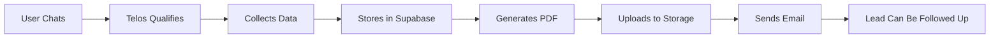

# 🎯 Lead Qualification Workflow — Complete Implementation Guide

> **Telos is now a Lead Qualification Assistant**, not a quote generator.

---

## 🚀 What Changed

### Before (❌ Broken)
```
User: "I need automation help"
Telos: "Your project will cost $5,000 for 4 weeks"
[Quote lost in chat, no lead data, no follow-up]
```

### After (✅ Proper Studio Workflow)
```
User: "I need automation help"
Telos: [Qualifies through conversation]
Telos: [Collects name, email, business]
Telos: "Your proposal will be emailed to you shortly"
→ PDF generated
→ Email sent with attachment
→ Lead stored in Supabase
→ Follow-up enabled
```

---

## 📋 Complete Workflow



### Detailed Steps

| Step | What Happens | File/System |
|------|--------------|-------------|
| **1. Discovery** | Telos asks about project, pain points, goals | `briefing.md` prompt |
| **2. Scoping** | Collects budget, timeline, priorities | `briefing.md` prompt |
| **3. Qualification** | Gets name, email, business, role | `briefing.md` prompt |
| **4. Validation** | Checks all required fields are collected | `chat.ts` API |
| **5. Storage** | Saves lead to Supabase `leads` table | `generate-quote.ts` |
| **6. PDF Generation** | Creates PDF from `quote-template.html` | `pdfGenerator.ts` |
| **7. Upload** | Stores PDF in Supabase Storage `quote-files` | `generate-quote.ts` |
| **8. Email** | Sends PDF to lead via Resend | `sendEmail.ts` |
| **9. Record** | Saves quote in `quotes` table | `generate-quote.ts` |
| **10. Follow-up** | Lead is tracked for future engagement | Supabase + n8n |

---

## 🧩 Required Data Fields

### Core Identity (REQUIRED)
- ✅ **Full Name** - For proposal personalization
- ✅ **Email** - Where to send the quote
- ✅ **Business Name** - Company context
- ⚪ **Role** - Decision-maker context (optional)

### Project Context (REQUIRED)
- ✅ **Project Summary** - What they need
- ✅ **Budget Range** - Qualification + scoping
- ✅ **Timeline** - Urgency + planning
- ⚪ **Current Tools** - Integration needs (optional)

Telos will NOT trigger quote generation until all REQUIRED fields are collected.

---

## ⚙️ Configuration Required

### 1. Resend Email Service

**Sign up**: https://resend.com

**Get API Key**:
1. Go to https://resend.com/api-keys
2. Create new API key
3. Copy key (starts with `re_...`)

**Add to `.env`**:
```bash
RESEND_API_KEY=re_your_actual_api_key_here
```

**For Testing**:
- Use `onboarding@resend.dev` as the `from` address
- Can send to any email without domain verification

**For Production**:
- Verify your domain in Resend dashboard
- Update `from` in `src/lib/sendEmail.ts` to your domain

---

### 2. Supabase Storage Bucket

**Create Bucket**:
1. Go to Supabase Dashboard → Storage
2. Create new bucket: `quote-files`
3. Set to **Public** (or configure RLS for signed URLs)

**Permissions**:
```sql
-- Allow public read access
CREATE POLICY "Public Access"
ON storage.objects FOR SELECT
USING (bucket_id = 'quote-files');

-- Allow authenticated uploads (your backend)
CREATE POLICY "Authenticated Upload"
ON storage.objects FOR INSERT
WITH CHECK (bucket_id = 'quote-files' AND auth.role() = 'service_role');
```

---

### 3. Supabase Schema (Already Configured)

Your existing schema from `supabase-schema.sql` already supports this workflow:

**Tables Used**:
- ✅ `leads` - Stores lead contact & project data
- ✅ `conversations` - Tracks chat history
- ✅ `quotes` - Stores generated quotes with PDF URLs
- ✅ `quote_files` (Storage) - Stores PDF files

**No migration needed!** 🎉

---

## 🧪 Testing the Workflow

### Manual Test

1. **Start dev server**:
```bash
npm run dev
```

2. **Chat with Telos** at http://localhost:4321

3. **Follow conversation**:
   - Tell Telos about your project
   - Answer budget/timeline questions
   - Provide name, email, business when asked

4. **Trigger quote**:
   - Telos will say: "Your proposal will be emailed to you shortly"

5. **Check console logs**:
```
📋 Generating quote for: John Doe
✅ Lead updated in Supabase
📄 Generating PDF...
✅ PDF generated successfully
✅ PDF uploaded to storage: [URL]
✅ Quote record saved to database
📧 [DEMO MODE] Email would be sent to: john@example.com
```

6. **If Resend is configured, check email**

---

### API Test (Direct)

**Test quote generation endpoint directly**:

```bash
curl -X POST http://localhost:4321/api/generate-quote \
  -H "Content-Type: application/json" \
  -d '{
    "lead": {
      "name": "John Doe",
      "email": "john@example.com",
      "business": "Acme Corp",
      "role": "CTO",
      "project_summary": "Automate client onboarding process",
      "budget": "$3,000-$5,000",
      "timeline": "4 weeks"
    }
  }'
```

**Expected Response**:
```json
{
  "success": true,
  "message": "Quote sent to john@example.com",
  "leadId": "uuid-here",
  "quoteUrl": "https://your-project.supabase.co/storage/v1/object/public/quote-files/...",
  "quoteData": { ... }
}
```

---

## 🔧 Troubleshooting

### PDF Generation Fails

**Error**: `html-pdf-node` not working on Vercel

**Solution**:
- html-pdf-node uses Puppeteer which may not work on Vercel
- Alternative: Use a PDF generation service like `@react-pdf/renderer` or `pdfmake`
- Or: Generate on a separate service (AWS Lambda, Cloud Functions)

### Email Not Sending

**Check**:
1. RESEND_API_KEY is in `.env`
2. API key is valid (starts with `re_`)
3. `from` email is verified or using `onboarding@resend.dev`

**Debug**:
```javascript
// In src/lib/sendEmail.ts
console.log('Resend API Key:', process.env.RESEND_API_KEY?.substring(0, 10) + '...');
```

### Supabase Storage Upload Fails

**Check**:
1. Bucket `quote-files` exists
2. Bucket is Public OR has correct RLS policies
3. PUBLIC_SUPABASE_URL and PUBLIC_SUPABASE_ANON_KEY in `.env`

**Test Storage**:
```javascript
const { data, error } = await supabase
  .storage
  .from('quote-files')
  .list();
  
console.log('Storage test:', data, error);
```

---

## 📊 Monitoring & Analytics

### Key Metrics to Track

1. **Lead Conversion Rate**
   - How many chats → complete qualification
   - Query: `SELECT COUNT(*) FROM leads WHERE status = 'quote_sent'`

2. **Quote Open Rate**
   - Track PDF downloads from storage
   - Add analytics to email links

3. **Response Time**
   - Average time from chat start → quote sent

4. **Follow-up Success**
   - Leads that convert after follow-up emails

### Supabase Queries

```sql
-- Leads by status
SELECT status, COUNT(*) FROM leads GROUP BY status;

-- Quotes sent today
SELECT COUNT(*) FROM quotes WHERE created_at >= CURRENT_DATE;

-- Conversion funnel
SELECT 
  COUNT(DISTINCT lead_id) as total_leads,
  COUNT(DISTINCT CASE WHEN status = 'quote_sent' THEN lead_id END) as qualified,
  COUNT(DISTINCT CASE WHEN status = 'converted' THEN lead_id END) as converted
FROM leads;
```

---

## 🚀 Next Steps

### Immediate
- [ ] Set up Resend API key
- [ ] Create Supabase Storage bucket
- [ ] Test workflow end-to-end
- [ ] Verify email delivery

### Short Term
- [ ] Connect chat API to auto-trigger `/api/generate-quote`
- [ ] Set up n8n workflow for follow-ups
- [ ] Create branded PDF template
- [ ] Add analytics tracking

### Long Term
- [ ] A/B test different qualification flows
- [ ] Implement automated follow-up sequences
- [ ] Build admin dashboard for lead management
- [ ] Add quote approval/signature flow

---

## 📚 Related Documentation

- **`SMART_GREETINGS.md`** - Dynamic greeting system
- **`HUMAN_USAGE_GUIDE.md`** - Strategic voice patterns
- **`TELOS_INTEGRATION.md`** - Prompt system architecture
- **`SETUP_GUIDE.md`** - General project setup

---

## ✅ Summary

**Old Telos**: Quote generator in chat (transactional, leads lost)  
**New Telos**: Lead qualification assistant (professional, trackable, scalable)

**Result**:
- ✅ Every lead is captured
- ✅ Professional proposals delivered via email
- ✅ CRM integration for follow-up
- ✅ Analytics and tracking
- ✅ Real studio workflow

**Status**: ✅ **Implemented** | 🧪 **Ready for Testing**

---

**Updated**: 2025-10-19  
**Version**: 1.0  
**Author**: Are You Human? Team

